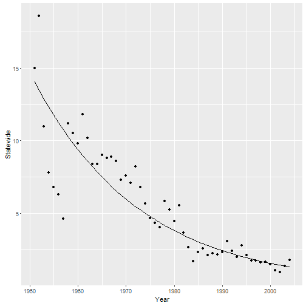

One of the longest running population time series in Nebraska is the Rural Mail Carrier Survey. Four times per year mail carriers across the state count the number of pheasants, grouse, quail, turkeys, cottontails, and jackrabbits encountered during their daily round. In each season, they count on four separate days, or sometimes fewer if bad weather occurs. They also record the number of miles driven on each route.

These data are combined into regional and statewide indices of pheasant abundance by calculating means and variances with each observation (card) weighted by the number of miles driven. The index is used to predict the quality of the coming pheasant season by comparing last year’s index with the present index. Statewide, there was a 29% increase in pheasant abundance from July 2003 to July 2004.

One of your colleagues has produced the following graph from the entire statewide time series. The line is a least-squares fit exponential population growth model which indicates an average annual decline of about 4% over the past fifty years. In contrast, views from pheasant conservation groups (see next page) and expressed in hunting magazines convey a high level of optimism about pheasant populations in Nebraska. Which of these views is correct? What hypotheses could account for the observed data, and how would you distinguish between them?

